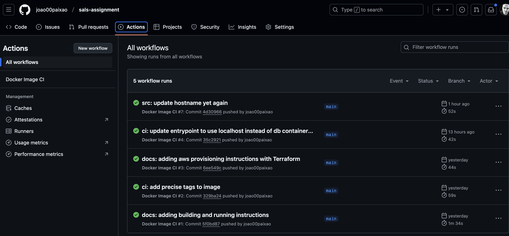
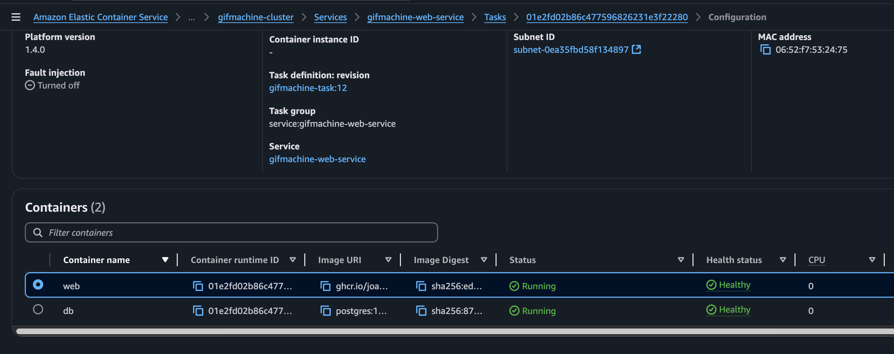
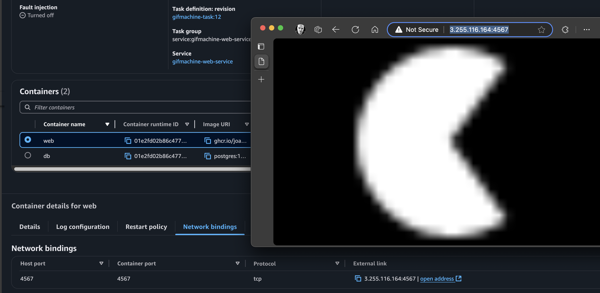

# sals-assignment
 Repository for Sample Application infrastructure and documentation.

## Setup

### Building and Running with Docker Compose

1. Clone this repository.
2. Run `docker compose build` to build the application.
3. Run `docker compose up` to start the application and database.
4. The application will be available at `http://localhost:4567`.

### Building and Running with Docker

1. Clone this repository.
2. Create a Docker network: `docker network create sals-network`
3. Run `docker run --name db --network sals-network -e POSTGRES_DB=gifmachine -e POSTGRES_USER=postgres -e POSTGRES_PASSWORD=postgres -p 5432:5432 postgres` to start the postgres container.
4. Run `docker build -t sals-assignment .` to build the application.
5. Run `docker run --name sals-assignment-container -p 4567:4567 -e POSTGRES_PASSWORD=postgres -e DATABASE_URL=postgres://postgres:postgres@db:5432/gifmachine -e GIFMACHINE_PASSWORD=foo -e RACK_ENV=development --network sals-network sals-assignment` to start the application.
6. The application will be available at `http://localhost:4567`.

### Provisioning AWS Resources with Terraform

1. Clone this repository.
2. Install and Authenticate into AWS Cli with `aws configure`.
3. Change directory to the "infra" folder.
4. Run `terraform init` to initialize the Terraform environment.
5. Run `terraform apply` to provision the AWS resources.
6. Run `terraform destroy` to destroy the AWS resources.

## Overview

For the initial challenge of creating a container of the Sample Application I decided to create a Dockerfile in this repository and from within the image I would clone the Sample Application's repository and do the build/run as instructed on the README.

The idea worked out well but there was a slight challenge with running the bash commands for running the db migrations after the db is up. So I decided to write a bash script to wait for the db to be up and then run the migration scripts. This worked well without the waiting mechanism when running with docker compose, as we can wait for the web container to go up only after the db is up.

After having successfully built and run the containers locally I needed to host the image somewhere. I decided to create a Github Actions Workflow (CI/CD pipeline) to build and push the docker image. This allowed me to have the image in Github Container Registry at: ghcr.io/joao00paixao/sals-assignment:latest

The next challenge was provisioning the AWS infrastructure. I opted to use ECS (Elastic Container Service) as obviously the idea was to use the hosted GHCR image. I remembered ECS had a serverless (Fargate) and EC2 options for the containers to run under the hood. I sticked with the serverless option for the ease of management and ease of setting up.

I ended up losing around 1-2 hours scratching my head and implementing an EC2 ECS cluster because I didn't know the arguments to the bundle exec rake command in the entrypoint bash. I believed the "db:migrate" part was "host:action" so I was going back to EC2 so I could have a different network mode of bridge, which is Docker's internal network, with the objective of having "db" as the hostname but then I searched regarding rake and I figured out it's just a namespace, not a host.

So I went back and recovered most of the code I did with Fargate and it all worked. As for the last exercise I created a simple health check that curls the local address until it returns something. This can be seen in the ECS Tasks panel.

I "lost" the most time understanding how the builds/dependencies in Ruby worked AND with my oversight with rake... assuming the parameters were incorrect, in total I spent around 4-5 hours. I felt confortable working with bash, Dockerfile, docker compose and github actions. Terraform with AWS was also a little bit challenging but no one can know the providers by heart.

## Resources

[How to build a Ruby app](https://cloud.google.com/docs/buildpacks/ruby?hl=pt-br#:~:text=Building%20a%20Ruby%20application%201%20Installing%20Dependencies%20Using,environment%20variables%20to%20customize%20your%20container%20BUNDLE_%20)

For the AWS Terraform resource definitions and parameters.

[AWS Terraform Provider documentation](https://registry.terraform.io/providers/hashicorp/aws/latest/docs)

For most properties I had to use this as reference.

[Amazon ECS Task Definition](https://docs.aws.amazon.com/AmazonECS/latest/developerguide/task-definition-template.html)

[Bundle Exec - what it is and how it fits with Ruby](https://reintech.io/term/bundle-exec-running-commands-bundler-managed-environment)

## Feedback

I enjoyed doing this assignment as it mixes knowledge between development, pipelines, infrastructure and how you tackle issues. It also brings up your expertise with all the necessary skills.

I personally felt it was a little hard because of my lack of experience with Ruby and practical AWS, but in the end it worked and I am very happy my solution.

This assignment took me 4-5 hours in total with 3-4 different sessions in a span of two days. I hope you enjoy this solution and my thought process behind it!

You can see the final result here: [gifmachine public ip in ECS cluster](http://3.255.116.164:4567/)

## Questions 

### What would you do if you had more time?

Currently we have to run terraform apply manually to provision the infrastructure but we can have this in a build pipeline as long as we have a global state hosted in S3 for example, so there are no conflicts.